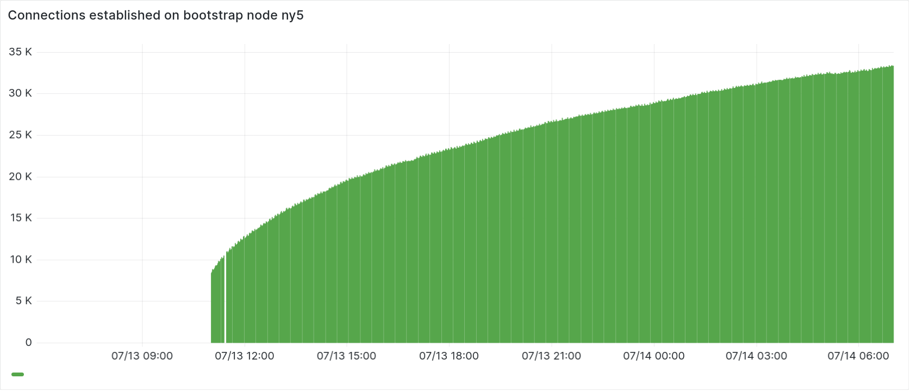

# Summary

Since 2023-07-13 one of the 4 IPFS bootstrap nodes is running [rust-libp2p](https://github.com/libp2p/rust-libp2p) instead of [Kubo](https://github.com/ipfs/kubo).
We run both Kubo and rust-libp2p based IPFS bootstrap nodes to increase resilience against bugs and attacks. A bug or vulnerability is less likely to be in both Kubo and rust-libp2p than Kubo alone. Further we gain experience running large rust-libp2p based deployments on the IPFS network.

TODO: Add UTC time as well?


TODO: Make the graph UTC?

# Bootstrap nodes

> A Bootstrap Node is a trusted peer on the IPFS network through which an IPFS node learns about other peers on the network. [...]

https://docs.ipfs.tech/concepts/glossary/#bootstrap-node

- What are IPFS bootstrap nodes?
  - Allows new nodes to join the IPFS network

- How does bootstrapping on IPFS work
  - connect to the bootstrap node
  - Run the Kademlia bootstrap procedure https://github.com/libp2p/specs/tree/master/kad-dht#bootstrap-process
    - also known as kademlia random walk
    - generate random peer id
    - look it up on the DHT
  - all the bootstrap nodes need to do is to respond to Kademlia find node requests and maintain a healthy routing table.

- The addresses of bootstrap nodes are shipped within the Kubo release binary.

``` go
// DefaultBootstrapAddresses are the hardcoded bootstrap addresses
// for IPFS. they are nodes run by the IPFS team. docs on these later.
// As with all p2p networks, bootstrap is an important security concern.
var DefaultBootstrapAddresses = []string{
	"/dnsaddr/bootstrap.libp2p.io/p2p/QmNnooDu7bfjPFoTZYxMNLWUQJyrVwtbZg5gBMjTezGAJN",
	"/dnsaddr/bootstrap.libp2p.io/p2p/QmQCU2EcMqAqQPR2i9bChDtGNJchTbq5TbXJJ16u19uLTa",
	"/dnsaddr/bootstrap.libp2p.io/p2p/QmbLHAnMoJPWSCR5Zhtx6BHJX9KiKNN6tpvbUcqanj75Nb",
	"/dnsaddr/bootstrap.libp2p.io/p2p/QmcZf59bWwK5XFi76CZX8cbJ4BhTzzA3gU1ZjYZcYW3dwt",
    // ...
}
```

https://github.com/ipfs/kubo/blob/4a5e99d7eaeada5596a0686fe93d4fa2da212452/config/bootstrap_peers.go#L11C1-L24C2

- How to discover them via `dig`?

```
dig +short -t txt _dnsaddr.bootstrap.libp2p.io
"dnsaddr=/dnsaddr/am6.bootstrap.libp2p.io/p2p/QmbLHAnMoJPWSCR5Zhtx6BHJX9KiKNN6tpvbUcqanj75Nb"
"dnsaddr=/dnsaddr/sv15.bootstrap.libp2p.io/p2p/QmNnooDu7bfjPFoTZYxMNLWUQJyrVwtbZg5gBMjTezGAJN"
"dnsaddr=/dnsaddr/sg1.bootstrap.libp2p.io/p2p/QmcZf59bWwK5XFi76CZX8cbJ4BhTzzA3gU1ZjYZcYW3dwt"
"dnsaddr=/dnsaddr/ny5.bootstrap.libp2p.io/p2p/QmQCU2EcMqAqQPR2i9bChDtGNJchTbq5TbXJJ16u19uLTa"
```

```
dig +short -t txt _dnsaddr.am6.bootstrap.libp2p.io
"dnsaddr=/ip6/2604:1380:4602:5c00::3/udp/4001/quic-v1/p2p/QmbLHAnMoJPWSCR5Zhtx6BHJX9KiKNN6tpvbUcqanj75Nb"
"dnsaddr=/ip6/2604:1380:4602:5c00::3/tcp/4001/p2p/QmbLHAnMoJPWSCR5Zhtx6BHJX9KiKNN6tpvbUcqanj75Nb"
"dnsaddr=/ip4/147.75.87.27/udp/4001/quic/p2p/QmbLHAnMoJPWSCR5Zhtx6BHJX9KiKNN6tpvbUcqanj75Nb"
"dnsaddr=/dns4/am6.bootstrap.libp2p.io/tcp/443/wss/p2p/QmbLHAnMoJPWSCR5Zhtx6BHJX9KiKNN6tpvbUcqanj75Nb"
"dnsaddr=/ip4/147.75.87.27/tcp/4001/p2p/QmbLHAnMoJPWSCR5Zhtx6BHJX9KiKNN6tpvbUcqanj75Nb"
"dnsaddr=/ip6/2604:1380:4602:5c00::3/udp/4001/quic/p2p/QmbLHAnMoJPWSCR5Zhtx6BHJX9KiKNN6tpvbUcqanj75Nb"
"dnsaddr=/ip4/147.75.87.27/udp/4001/quic-v1/p2p/QmbLHAnMoJPWSCR5Zhtx6BHJX9KiKNN6tpvbUcqanj75Nb"
"dnsaddr=/dns6/am6.bootstrap.libp2p.io/tcp/443/wss/p2p/QmbLHAnMoJPWSCR5Zhtx6BHJX9KiKNN6tpvbUcqanj75Nb"
```

```
libp2p-lookup direct --address /dnsaddr/am6.bootstrap.libp2p.io/p2p/QmbLHAnMoJPWSCR5Zhtx6BHJX9KiKNN6tpvbUcqanj75Nb

Lookup for peer with id PeerId("QmbLHAnMoJPWSCR5Zhtx6BHJX9KiKNN6tpvbUcqanj75Nb") succeeded.

Protocol version: "ipfs/0.1.0"
Agent version: "kubo/0.20.0/b8c4725"
Observed address: "/ip6/2001:ac8:40:b6::a06e/udp/35415/quic-v1"
Listen addresses:
        - "/ip4/147.75.87.27/tcp/4001"
        - "/ip4/147.75.87.27/udp/4001/quic"
        - "/ip4/147.75.87.27/udp/4001/quic-v1"
        - "/ip4/147.75.87.27/udp/4001/quic-v1/webtransport/certhash/uEiAklfaHBsO67_R1ytORipaz_4s7TlmAYmNFTi7LZeLPJQ/certhash/uEiAZgVX1dsfgsPDmKkbIO1__8wzC4RypPYAJrab5YB6F_Q"
        - "/ip6/2604:1380:4602:5c00::3/tcp/4001"
        - "/ip6/2604:1380:4602:5c00::3/udp/4001/quic"
        - "/ip6/2604:1380:4602:5c00::3/udp/4001/quic-v1"
        - "/ip6/2604:1380:4602:5c00::3/udp/4001/quic-v1/webtransport/certhash/uEiAklfaHBsO67_R1ytORipaz_4s7TlmAYmNFTi7LZeLPJQ/certhash/uEiAZgVX1dsfgsPDmKkbIO1__8wzC4RypPYAJrab5YB6F_Q"
        - "/dns4/am6.bootstrap.libp2p.io/tcp/443/wss/p2p/QmbLHAnMoJPWSCR5Zhtx6BHJX9KiKNN6tpvbUcqanj75Nb"
        - "/dns6/am6.bootstrap.libp2p.io/tcp/443/wss/p2p/QmbLHAnMoJPWSCR5Zhtx6BHJX9KiKNN6tpvbUcqanj75Nb"
Protocols:
        - /ipfs/ping/1.0.0
        - /libp2p/circuit/relay/0.2.0/stop
        - /ipfs/kad/1.0.0
        - /ipfs/lan/kad/1.0.0
        - /libp2p/autonat/1.0.0
        - /ipfs/id/1.0.0
        - /ipfs/id/push/1.0.0
        - /ipfs/bitswap/1.2.0
        - /ipfs/bitswap/1.1.0
        - /ipfs/bitswap/1.0.0
        - /ipfs/bitswap
        - /x/
        - /libp2p/circuit/relay/0.2.0/hop
        - /libp2p/dcutr
```

Note the `Agent version: "kubo/0.20.0/b8c4725"`.

# Motivation

- Implementation diversity
  - More stability
  - Security i.e. attack resilience
  - Bug or vulnerability is less likely to occur in both Kubo and rust-libp2p
- Rust in the IPFS network
- large scale rust-libp2p deployment
  - Other large deployments are Polkadot and Ethereum

# rust-libp2p in action

Now deployed on IPFS bootstrap node `ny5`.

Show graphs
- Connection establishment
- Memory usage
- Mention bytes per connection
- Incoming Kademlia requests


```
libp2p-lookup direct --address /dnsaddr/ny5.bootstrap.libp2p.io
Local peer id: 12D3KooWDqFbqh5PcCRAQpS8AuvpQvYqyVwtCA7PRfDjPTa1VXfx
Lookup for peer with id PeerId("QmQCU2EcMqAqQPR2i9bChDtGNJchTbq5TbXJJ16u19uLTa") succeeded.

Protocol version: "ipfs/0.1.0"
Agent version: "rust-libp2p-server/0.12.0"
Observed address: "/ip4/217.138.252.235/udp/42170/quic"
Listen addresses:
        - "/ip4/10.66.201.1/tcp/4001"
        - "/ip6/2604:1380:45d2:8100::1/tcp/4001"
        - "/ip6/fe80::f45f:43ff:fefb:7655/tcp/4001"
        - "/ip4/10.66.201.1/udp/4001/quic"
        - "/ip4/172.17.0.1/tcp/4001"
        - "/ip4/147.75.198.209/tcp/4001"
        - "/ip4/127.0.0.1/tcp/4001"
        - "/ip4/127.0.0.1/udp/4001/quic"
        - "/ip6/fe80::42:2dff:fec6:72a4/tcp/4001"
        - "/dns4/ny5.bootstrap.libp2p.io/tcp/443/wss/p2p/QmQCU2EcMqAqQPR2i9bChDtGNJchTbq5TbXJJ16u19uLTa"
        - "/ip4/147.75.198.209/udp/4001/quic"
        - "/ip4/172.17.0.1/udp/4001/quic"
        - "/dns6/ny5.bootstrap.libp2p.io/tcp/443/wss/p2p/QmQCU2EcMqAqQPR2i9bChDtGNJchTbq5TbXJJ16u19uLTa"
        - "/ip6/fe80::434:95ff:fe46:9d5d/tcp/4001"
        - "/ip6/fe80::b696:91ff:fe6f:3248/tcp/4001"
        - "/ip6/::1/tcp/4001"
Protocols:
        - /ipfs/kad/1.0.0
        - /ipfs/id/push/1.0.0
        - /ipfs/ping/1.0.0
        - /ipfs/id/1.0.0
        - /libp2p/circuit/relay/0.2.0/hop
```

Note the `Agent version: "rust-libp2p-server/0.12.0"`.

- Show rust-libp2p-server repository
  - Thin wrapper around rust-libp2p
  - Stress that rust-libp2p-server is a stripped down IPFS only, i.e. that it only does Kademlia.
- link to tracking issue https://github.com/protocol/bifrost-infra/issues/2622
- Publish Grafana dashboard
  - Stress number of connections and memory usage
- Majority is QUIC connections

FAQ:

- Do we plan to run rust-libp2p-server on all IPFS bootstrap nodes?

  No.
